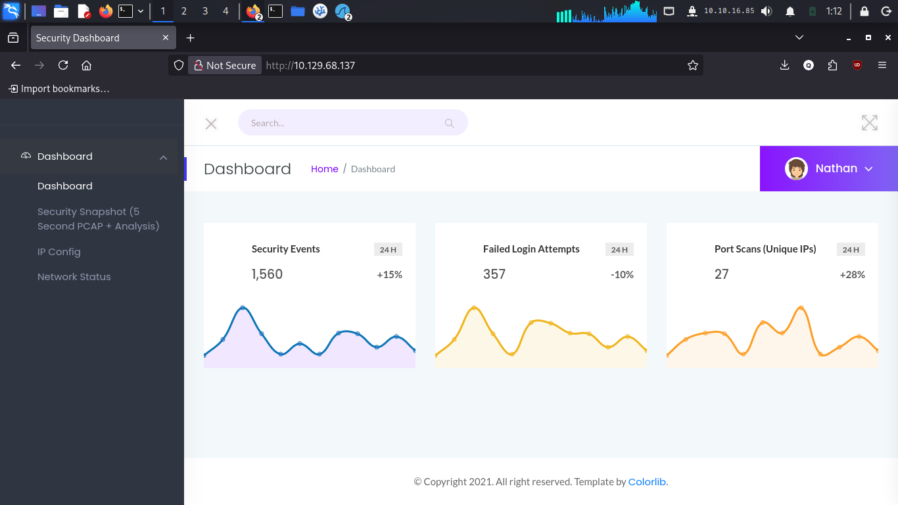
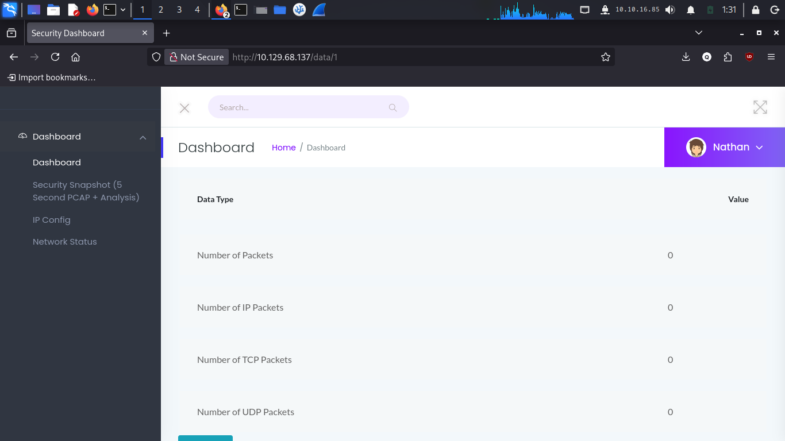

# HTB — Cap (Linux) — Fácil

**Plataforma:** Hack The Box  
**IP:** `10.129.68.137`  
**Fecha:** `2026-01-21`  
**Autor del write-up:** `R4Wbytes`  

> Nota OPSEC: no reutilizar credenciales fuera del laboratorio.

---

## Resumen ejecutivo
- **Cadena de compromiso (kill chain):** Recon → Enumeración → Foothold → Escalada → Root/System
- **Foothold:** IDOR en “Security Dashboard” expone PCAP; credenciales FTP en texto claro; reutilización contra SSH.
- **PrivEsc:** mala configuración de **Linux capabilities**: `/usr/bin/python3.8` con `cap_setuid` permite elevar a UID 0 (root).
- **Pruebas:** `user.txt` y `root.txt`

---

## 0) Preparación del entorno
**Herramientas utilizadas:** `nmap`, `whatweb`, `wireshark`, `ssh`

---

## 1) Reconocimiento y enumeración inicial

### 1.1 Nmap (TCP)

#### 1.1.1 Escaneo completo de puertos
**Comando:**
```bash
sudo nmap -p- --open -sS --min-rate 5000 -vvv -n -Pn -oG Full_Scan 10.129.68.137
```

**Salida (relevante):**
```text
21/tcp open  ftp
22/tcp open  ssh
80/tcp open  http
```

**Descripción:**  
Se realizó un escaneo completo de puertos TCP (`1–65535`) para identificar servicios expuestos. El host respondió como **Up** y se detectaron **21/FTP**, **22/SSH** y **80/HTTP** como puertos abiertos.

#### 1.1.2 Escaneo dirigido con detección de versiones y scripts por defecto
**Comando:**
```bash
sudo nmap -p21,22,80 -sCV -oN Targeted_Scan 10.129.68.137
```

**Salida (relevante):**
```text
21/tcp open  ftp   vsftpd 3.0.3
22/tcp open  ssh   OpenSSH 8.2p1 Ubuntu 4ubuntu0.2 (protocol 2.0)
80/tcp open  http  Gunicorn
|_http-server-header: gunicorn
|_http-title: Security Dashboard
Service Info: OSs: Unix, Linux
```

**Descripción:**  
El escaneo dirigido confirmó versiones y scripts por defecto. Se identificó **vsftpd 3.0.3** (21), **OpenSSH 8.2p1 (Ubuntu)** (22) y un servicio web servido por **Gunicorn** (80) con título **“Security Dashboard”**, consistente con un entorno **Linux/Unix**.

---

### 1.2 WhatWeb (fingerprinting HTTP)

**Comando:**
```bash
whatweb http://10.129.68.137:80
```

**Salida (relevante):**
```text
[200 OK] Bootstrap, HTML5, HTTPServer[gunicorn], JQuery[2.2.4], Modernizr[2.8.3.min], Title[Security Dashboard]
```

**Descripción:**  
Se confirmó fingerprinting del stack web: **Gunicorn** y dependencias del lado cliente (Bootstrap, jQuery, Modernizr), útil para orientar enumeración de la aplicación y sus endpoints.

---

### 1.3 HTTP (Security Dashboard) e identificación de IDOR

**Evidencia (capturas):**
- 
- 
- 
- 

**Descripción:**  
La aplicación expone un módulo **“Security Snapshot (5 Second PCAP + Analysis)”** que genera/visualiza capturas. Al crear/consultar una captura, se observó un esquema de URL predecible del tipo `http://10.129.68.137/data/<id>`, donde `<id>` aparenta ser incremental.

Al enumerar IDs, se verificó:

- `http://10.129.68.137/data/2` y `http://10.129.68.137/data/1`: capturas sin tráfico (0 paquetes).
- `http://10.129.68.137/data/0`: captura con tráfico (72 paquetes totales; 69 IP; 69 TCP; 0 UDP).

Esto confirma una vulnerabilidad **IDOR (Insecure Direct Object Reference)**: es posible acceder a objetos (capturas/PCAP) únicamente conociendo su identificador, sin validación de autorización. A continuación se analizó el PCAP asociado a `data/0`.

---

### 1.4 Análisis de PCAP con Wireshark


**Descripción:**  
Se inspeccionó el PCAP expuesto. Dado que **FTP transmite credenciales en texto claro**, se priorizó el canal de control FTP.

**Filtro aplicado:**
```text
ftp.request && (ftp.request.command == "USER" || ftp.request.command == "PASS")
```

**Hallazgo:**  
El filtro reveló credenciales en texto claro:

- `USER nathan`
- `PASS Buck3tH4TF0RM3!`

Estas credenciales permiten probar reutilización contra otros servicios expuestos, en particular **SSH/22**.

> Nota: si el write-up se publica, se recomienda **redactar** la contraseña.

---

## 2) Foothold (acceso inicial)

### 2.1 Acceso vía SSH con credenciales recuperadas

Con las credenciales obtenidas del PCAP, se intentó autenticación por SSH como `nathan`. La autenticación fue exitosa, confirmando reutilización de credenciales entre servicios.

**Comando:**
```bash
ssh nathan@10.129.68.137
```

En el primer acceso, SSH solicitó confirmación de autenticidad del host (huella **ED25519**) y registró la clave en `~/.ssh/known_hosts`. OpenSSH mostró una advertencia informativa relacionada con intercambio de claves post-cuántico, sin impacto práctico para el laboratorio.

---

### 2.2 Validación de identidad y grupos

**Comando:**
```bash
whoami && id
```

**Resultado:**
```text
nathan
uid=1001(nathan) gid=1001(nathan) groups=1001(nathan)
```

La sesión corresponde a un usuario **no privilegiado** (`nathan`), quedando listo el entorno para enumeración local y escalada.

---

### 2.3 Obtención de `user.txt`

**Comando:**
```bash
ls && cat user.txt
```

**Resultado:**
```text
snap  user.txt
7e6e5ecbcfab2491d92605f7d2d90478
```

Se obtuvo el flag de usuario, validando el objetivo **user-level** antes de proceder con la escalada de privilegios.

---

## 3) Escalada de privilegios

### 3.1 Enumeración local (LinPEAS)

Tras obtener acceso como `nathan`, se realizó enumeración local automatizada para identificar vectores de escalada (SUID/SGID, `sudoers`, capabilities, servicios y configuraciones débiles). Para ello se transfirió y ejecutó LinPEAS desde el host atacante mediante un servidor HTTP temporal.

> Buenas prácticas: en entornos reales, evite ejecutar scripts por *pipe* (p. ej., `curl | bash`) sin revisión/validación previa. En laboratorio resulta práctico, pero no es un patrón recomendable.

### 3.2 Hallazgo clave: capabilities peligrosas en `python3.8`

El hallazgo determinante fue la presencia de **capabilities** asignadas al intérprete de Python:

```text
/usr/bin/python3.8 = cap_setuid,cap_net_bind_service+eip
```

**Impacto:** `cap_setuid` habilita a un proceso a cambiar su UID efectivo. Si un binario de propósito general (como un intérprete) dispone de esta capability, un usuario no privilegiado puede ejecutar lógica que fuerce el UID efectivo a **0** y, posteriormente, ejecutar comandos como root.

> `+eip` indica que las capabilities están presentes en **Effective**, **Inheritable** y **Permitted**, por lo que se aplican directamente al proceso al ejecutar el binario.

### 3.3 Obtención de shell con UID 0

Se validó la escalada obteniendo una shell con **UID 0** (root) desde el contexto del usuario `nathan`.

**Evidencia:**
```text
root
uid=0(root) gid=1001(nathan) groups=1001(nathan)
```

> Nota: el GID/grupos pueden mantenerse en los del usuario original; el indicador principal de escalada es `uid=0(root)`.

### 3.4 Obtención de `root.txt`
Una vez con UID 0, se procede a recuperar el flag de root.

```text
321abcb97453a092b0f4a8fe3bd0006d
```
